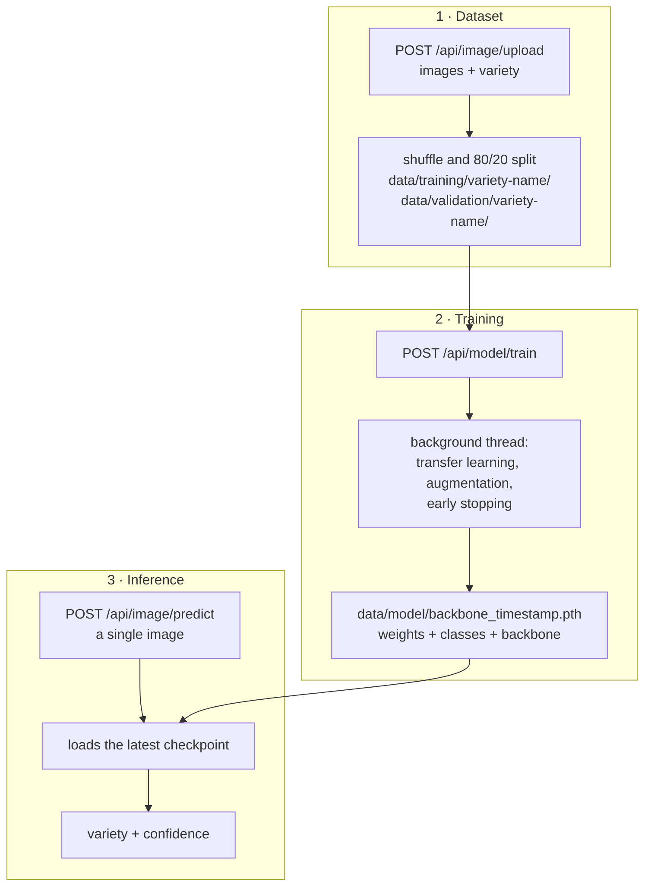

<div align="center">

# Vitis AI

**Grapevine variety classification from images, served as a REST API.**

Upload labelled images, kick off training with a single HTTP call, and classify new photos to get a variety and a confidence score.

[](https://github.com/Lorenzo-Benvenuti/vitis-ai/actions/workflows/tests.yml)
[](https://www.python.org/)
[](https://fastapi.tiangolo.com/)
[](https://pytorch.org/)
[](LICENSE)

</div>

---

## Table of contents

- [What it is](#what-it-is)
- [Features](#features)
- [How it works](#how-it-works)
- [Requirements](#requirements)
- [Installation](#installation)
- [Running the server](#running-the-server)
- [API](#api)
- [Training parameters](#training-parameters)
- [Project layout](#project-layout)
- [Design notes](#design-notes)
- [Tests](#tests)
- [Known limitations](#known-limitations)
- [Roadmap](#roadmap)
- [License](#license)

---

## What it is

Vitis AI is an image classification service built for digital ampelography: telling grapevine varieties and accessions apart (Sangiovese, Merlot, Nebbiolo…) from photographs of leaves or grape clusters.

Rather than a script you run by hand, the entire model lifecycle (dataset collection, training, inference) sits **behind three HTTP endpoints**. The dataset is assembled by uploading images through the API, training starts with a POST and runs in the background, and the trained model is immediately queryable.

Under the hood it uses **transfer learning**: it starts from a backbone pre-trained on ImageNet and retrains its classification head on the uploaded varieties. That makes reasonable results possible with a few hundred images per class, where training from scratch would fail outright.

## Features

- **API-first** — dataset, training and inference are fully driven over REST, no code changes required.
- **Swappable backbones** — `resnet18` (default), `resnet50`, `efficientnet_b0`, `mobilenet_v3_small`, picked at runtime in the training request.
- **Non-blocking training** — the endpoint returns `202 Accepted` and training continues on a background thread.
- **Early stopping + best checkpoint** — the model saved is the one from the best validation epoch, not the last one.
- **Self-describing checkpoints** — every `.pth` carries weights, class names and backbone, so the file alone is enough for inference, with no dependency on the dataset on disk.
- **Configurable data augmentation** — flips, rotation, perspective, colour jitter, blur and random erasing, all tunable per request.
- **Automatic 80/20 split** — uploaded images are shuffled and divided between training and validation at upload time.
- **Per-class accuracy** — every epoch logs the accuracy of each variety, so weak classes surface immediately.
- **GPU-aware** — uses CUDA when available, falls back to CPU, with no configuration.
- **Interactive docs** — Swagger UI and ReDoc generated automatically by FastAPI.

## How it works



Classes are never declared anywhere: they are inferred from the subdirectory names created during upload (torchvision's `ImageFolder`). Uploading images with `variety: "nebbiolo"` creates the *nebbiolo* class, and the next training run picks it up automatically.

## Requirements

- **Python 3.11**
- **pipenv** for environment and dependency management (a plain `requirements.txt` is provided as an alternative)
- Optional: an NVIDIA GPU with CUDA to speed up training
- Optional: [cURL](https://curl.se/) or [Postman](https://www.postman.com/) to exercise the API

## Installation

```bash
# 1 · Clone the repository
git clone https://github.com/Lorenzo-Benvenuti/vitis-ai.git
cd vitis-ai

# 2 · Install pipenv (if you don't have it yet)
pip install pipenv

# 3 · Create the virtual environment and install every dependency, development ones included (pytest, httpx)
pipenv install --dev

# 4 · Activate the environment
pipenv shell
```

> [!TIP]
> `pipenv install` creates and manages the virtual environment for you — there is no need to create a `venv/` by hand. Instead of `pipenv shell` you can prefix any command with `pipenv run`.

<details>
<summary><b>Prefer plain pip and venv?</b></summary>

```bash
python -m venv .venv
source .venv/bin/activate        # Windows: .venv\Scripts\activate
pip install -r requirements.txt -r requirements-dev.txt
```

`Pipfile.lock` remains the source of truth for fully reproducible installs; `requirements.txt` mirrors the direct dependencies for anyone not using pipenv.

</details>

## Running the server

```bash
python -m src.main
```

The server listens on **`http://0.0.0.0:8080`**.

| Resource | URL |
| --- | --- |
| Interactive docs (Swagger UI) | http://localhost:8080/docs |
| Alternative docs (ReDoc) | http://localhost:8080/redoc |
| OpenAPI schema | http://localhost:8080/openapi.json |

## API

All endpoints live under the `/api` prefix.

| Method | Endpoint | Description |
| --- | --- | --- |
| `POST` | `/api/image/upload` | Add labelled images to the dataset |
| `POST` | `/api/model/train` | Start training in the background |
| `POST` | `/api/image/predict` | Classify a single image |

---

### `POST /api/image/upload`

Uploads one or more images of a given variety. They are shuffled, split between training (80%) and validation (20%), and written to disk under UUID filenames.

**Content-Type:** `multipart/form-data`

| Field | Type | Required | Description |
| --- | --- | --- | --- |
| `images` | file (repeatable) | ✅ | One or more `.jpg`, `.jpeg` or `.png` images |
| `metadata` | JSON string | ✅ | `{"variety": "sangiovese"}` — letters, digits, spaces, `-` and `_` only |

```bash
curl -X POST http://localhost:8080/api/image/upload \
  -F "images=@sangiovese1.jpg" \
  -F "images=@sangiovese2.jpg" \
  -F 'metadata={"variety":"sangiovese"}'
```

**`200 OK`**

```json
{
  "uploaded": 2,
  "train_count": 1,
  "validation_count": 1,
  "variety": "sangiovese"
}
```

| Status | Cause |
| --- | --- |
| `400` | Unsupported extension, malformed `metadata`, or `variety` containing disallowed characters |
| `500` | Writing to disk failed |

---

### `POST /api/model/train`

Trains on everything currently under `data/training` and `data/validation`. The response is immediate: training continues on a daemon thread and its progress shows up in the server logs.

**Content-Type:** `application/json` · **Every field is optional.**

```bash
curl -X POST http://localhost:8080/api/model/train \
  -H "Content-Type: application/json" \
  -d '{"epochs":20,"lr":0.001,"batch_size":32,"backbone":"resnet18"}'
```

**`202 Accepted`**

```json
{
  "status": "started",
  "message": "Training started in the background."
}
```

| Status | Cause |
| --- | --- |
| `400` | `data/training` or `data/validation` is missing, or both are empty |
| `422` | Parameters outside their constraints (e.g. `epochs` ≤ 0, unknown backbone) |

When training finishes, the best checkpoint is written to `data/model/<backbone>_<YYYYMMDD>_<HHMMSS>.pth`.

---

### `POST /api/image/predict`

Classifies a single image using **the most recently trained model** (the most recently modified checkpoint in `data/model/`).

**Content-Type:** `multipart/form-data`

| Field | Type | Required | Description |
| --- | --- | --- | --- |
| `image` | file | ✅ | A single `.jpg`, `.jpeg` or `.png` image |

```bash
curl -X POST http://localhost:8080/api/image/predict \
  -F "image=@grape.jpg"
```

**`200 OK`**

```json
{
  "variety": "sangiovese",
  "confidence": 0.9237
}
```

`confidence` is the softmax probability of the predicted class, in the `[0, 1]` range.

| Status | Cause |
| --- | --- |
| `400` | Unsupported format, or a corrupted / undecodable file |
| `404` | No model has been trained yet |

## Training parameters

### Hyperparameters

| Field | Type | Default | Constraints |
| --- | --- | --- | --- |
| `epochs` | integer | `20` | > 0 |
| `lr` | float | `0.001` | > 0 |
| `batch_size` | integer | `32` | > 0 |
| `backbone` | string | `"resnet18"` | `resnet18` · `resnet50` · `efficientnet_b0` · `mobilenet_v3_small` |
| `augmentation` | object | see below | — |

### Augmentation

Applied to **training only**.

Validation uses a deterministic preprocessing pipeline (resize 256 → center crop 224 → ImageNet normalisation) so measurements stay repeatable.

| Field | Type | Default | Effect |
| --- | --- | --- | --- |
| `horizontal_flip` | bool | `true` | Random horizontal flip |
| `vertical_flip_p` | float | `0.2` | Probability of a vertical flip |
| `rotation` | float | `30.0` | Maximum random rotation, in degrees |
| `color_jitter_brightness` | float | `0.4` | Brightness variation |
| `color_jitter_contrast` | float | `0.4` | Contrast variation |
| `color_jitter_saturation` | float | `0.5` | Saturation variation |
| `color_jitter_hue` | float | `0.1` | Hue variation |
| `random_erasing_p` | float | `0.3` | Probability of blanking a random patch |

Setting a field to `0` (or `false`) disables the corresponding transform.

<details>
<summary><b>Example: aggressive training on EfficientNet</b></summary>

```bash
curl -X POST http://localhost:8080/api/model/train \
  -H "Content-Type: application/json" \
  -d '{
    "epochs": 60,
    "lr": 0.0005,
    "batch_size": 16,
    "backbone": "efficientnet_b0",
    "augmentation": {
      "horizontal_flip": true,
      "vertical_flip_p": 0.5,
      "rotation": 45,
      "color_jitter_brightness": 0.5,
      "color_jitter_contrast": 0.5,
      "color_jitter_saturation": 0.6,
      "color_jitter_hue": 0.15,
      "random_erasing_p": 0.4
    }
  }'
```

</details>

<details>
<summary><b>Example: small, clean dataset with minimal augmentation</b></summary>

```bash
curl -X POST http://localhost:8080/api/model/train \
  -H "Content-Type: application/json" \
  -d '{
    "epochs": 15,
    "backbone": "mobilenet_v3_small",
    "augmentation": {
      "vertical_flip_p": 0,
      "rotation": 10,
      "random_erasing_p": 0
    }
  }'
```

</details>

## Project layout

```
vitis-ai/
├── src/
│   ├── main.py              # Entry point: builds the FastAPI app and starts uvicorn
│   ├── api/
│   │   ├── routes.py        # The three endpoints: upload, train, predict
│   │   └── schemas.py       # Pydantic request/response models and validation
│   └── utils/
│       ├── images.py        # Writing uploads to disk under UUID filenames
│       ├── dataset.py       # DataLoaders, training and validation transforms
│       ├── model.py         # Backbone registry, model build/save/load
│       ├── training.py      # Training loop, early stopping, metrics
│       └── inference.py     # Latest-checkpoint lookup and prediction
├── tests/
│   └── test_api.py          # End-to-end tests for the three endpoints
├── data/
│   ├── training/            # data/training/<variety>/*.jpg   (generated)
│   ├── validation/          # data/validation/<variety>/*.jpg (generated)
│   └── model/               # .pth checkpoints                (generated)
├── .github/workflows/       # CI: runs the test suite on every push
├── Pipfile                  # Dependencies
├── requirements.txt         # Same dependencies, for plain pip users
└── pytest.ini
```

> [!NOTE]
> The contents of `data/` are excluded from version control through `.gitignore`: datasets and checkpoints stay local.

## Design notes

<details>
<summary><b>Transfer learning and the backbone registry</b></summary>

Each backbone is loaded with its ImageNet weights and its final linear layer is replaced by a fresh head sized to the number of varieties present. Where that head lives differs per architecture (`fc` on ResNets, `classifier[1]` on EfficientNet, `classifier[3]` on MobileNet), so each family gets its own helper.

The constructors are collected in a registry: adding a model means adding one dictionary entry, and the list of supported backbones stays in sync on its own.

</details>

<details>
<summary><b>Training loop</b></summary>

- **Optimizer:** Adam, with a configurable learning rate
- **Loss:** cross-entropy
- **Scheduler:** `StepLR` (step 7 epochs, γ = 0.1)
- **Early stopping:** patience of `max(5, epochs // 5)` epochs without validation improvement
- **Best checkpoint:** the weights of the best epoch are kept in memory and restored before saving
- **Metrics:** every epoch logs training and validation loss and accuracy, plus per-class accuracy

</details>

<details>
<summary><b>Self-describing checkpoints</b></summary>

A `.pth` file holds more than a `state_dict`: it also stores the ordered class list and the backbone name. Inference can therefore rebuild the exact architecture and map a predicted index back to a variety name **without re-reading the dataset**, which may well have changed in the meantime.

Loading uses `torch.load(..., weights_only=True)`: only tensors and primitive types are deserialised, never arbitrary Python objects.

</details>

<details>
<summary><b>Input validation and safety</b></summary>

- `variety` ends up in a filesystem path, so it is constrained by the `[\w -]+` regex: path separators and `..` are rejected with a `400`, closing off path traversal.
- Allowed extensions are checked before any heavy work happens.
- On prediction the image is decoded immediately (`Image.load()`) to catch truncated or corrupted files before they reach the model.
- Uploaded files are renamed with a UUID: no user-supplied name ever reaches the filesystem.
- Files are copied in chunks via `shutil.copyfileobj`, never loading a whole image into memory.

</details>

<details>
<summary><b>Train / inference consistency</b></summary>

Prediction and validation share the same preprocessing pipeline (`val_transforms`) and the same ImageNet normalisation used during training. If the two diverged, the model would see different inputs in production than the ones it was evaluated on, and the reported confidence would lose its meaning.

</details>

## Tests

The suite covers all three endpoints end to end with FastAPI's `TestClient`: 14 tests (15 cases including parametrisation), all running offline against temporary directories, downloading no weights and touching no real dataset.

```bash
pipenv run pytest -q
```

Covered: single and multiple uploads, correctness of the 80/20 split, accepted and rejected formats, malformed metadata, path traversal attempts, training with a missing or empty dataset, successful training kick-off, and inference with no model, an invalid file, and the happy path.

## Known limitations

- **No authentication.** The endpoints are open: the service is meant to run on a local network or behind a reverse proxy that handles access control.
- **Training state is not queryable.** Progress is only visible in the server logs; there is no endpoint reporting the current epoch or final outcome.
- **The 80/20 split is per upload**, not global across the dataset: uploading images one at a time would send them all to validation (`int(1 × 0.8) = 0`). Upload in batches.
- **The latest checkpoint always wins** — there is no way to select or compare earlier models.
- **One training run at a time** is recommended: concurrent calls to `/api/model/train` would start parallel threads competing for the same resources.

## Roadmap

- [ ] A `GET /api/model/status` endpoint to follow training progress
- [ ] Endpoints to list, select and delete saved checkpoints
- [ ] Top-k predictions instead of only the single most likely class
- [ ] Stratified split computed over the whole dataset rather than per upload
- [ ] Confusion matrix and classification report at the end of training
- [ ] Docker packaging

## License

Released under the MIT License. See [`LICENSE`](LICENSE) for the full text.
